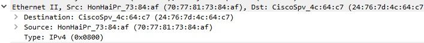

## การวิเคราะห์ข้อมูลเครือข่ายด้วย Wireshark

**Wireshark** คือ โปรแกรมที่ดักจับข้อมูลบน wifi และยังสามารถจับข้อมูลในระบบ network ได้ รวมถึงอ่านข้อมูล packet จาก file มาวิเคราะห์ได้

### การติดตั้ง Wireshark
สามารถ download โปรแกรมและติดตั้งได้ฟรี
Link: https://www.wireshark.org/download.html

เมื่อติดตั้งเสร็จแล้ว ไอคอนโปรแกรม Wireshark ก็จะหน้าตาแบบนี้

เมื่อเข้าโปรแกรมแล้วหน้าตาโปรแกรมก็เป็นแบบนี้

เมื่อเข้ามาแล้วให้คลิกเข้าตรงนี้ เพื่อเข้าดูว่าโปรแกรมจับข้อมูลจาก wifi ได้อะไรบ้าง

เมื่อคลิกเข้ามาแล้วก็จะได้แบบนี้

ถ้าเราต้องการค้นหาข้อมูลประเภท TCP ให้ พิมพ์ TCP ลงไปในช่องนี้ เพื่อดูแค่ข้อมูลประเภท TCP เท่านั้น

ถ้าเราต้องการดูข้อมูลของการเชื่อมต่ออันไหนก็แค่คลิกเข้าไปดู แล้วดูข้อมูลก็จะใช้ข้อมูลจากในกรอบสีแดงไปใช้ในการวิเคราะห์ข้อมูลเครือข่าย

สามารถดูว่าเป็นเฟรมที่เท่าไหร่ (ในกรอบสีแดง) เป็นเฟรมกี่บิต ความยาวเท่าไหร่ (ในกรอบสีเขียว)

ดู interface การเชื่อมต่อได้จากตรงนี้ 

สามารถดูข้อมูล IPv4 ได้จากตรงนี้ ว่าความยาวเท่าไหร่ 

IP ต้นทาง และ IP ปลายทาง คือเลขอะไร

สามารถดูพอร์ตต้นทางและพอร์ตปลายทางได้จากตรงนี้

จะเห็นพอร์ตปลายทางน้อยกว่าพอร์ตต้นทาง เป็นการเชื่อมต่อจาก client ไปหา server
